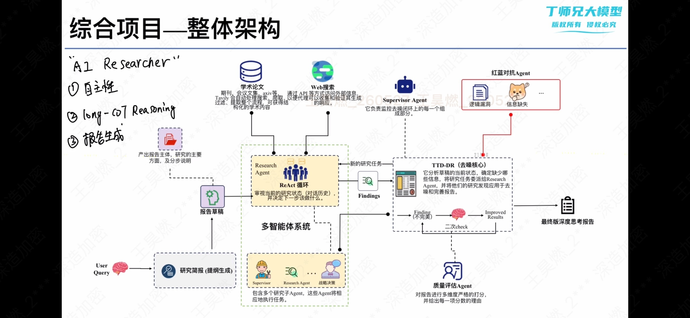

# DeepResearchAgent

基于 LangGraph + LangChain 的多智能体深度研究系统。项目将用户的复杂问题拆解为研究简报、报告初稿、并行检索、草稿修订和质量评估等阶段，最终生成结构化的深度研究报告。

## 整体架构



架构图展示了项目的核心思想：以 Supervisor Agent 为协调中心，让多个 Research Agent 通过 ReAct 循环完成资料检索，再结合 Findings、报告草稿、质量评估 Agent 和红蓝对抗 Agent，迭代生成最终报告。

> 图中的 TTD-DR（去噪核心）是对“研究结果不断补充、草稿不断修订”的概念化表达。在当前代码中，它主要对应 `deep_research/agents/supervisor.py` 中的 Supervisor 循环、草稿精修、Evaluator 评分和 Red Team 反馈逻辑。

## 项目解决的问题

传统的“单次 LLM 调用写报告”通常存在资料不足、事实依据弱、结构不稳定和无法持续修正等问题。本项目通过多智能体协作解决这些问题：

- 将复杂研究问题转换为更具体的研究简报。
- 先生成可迭代的报告初稿，再用外部资料补充。
- 允许 Supervisor 将不同子主题并行委派给 Research Agent。
- 对网页内容进行去重、摘要和格式化，降低上下文噪声。
- 使用质量评估和 Red Team 机制发现报告缺陷。
- 最后由 Writer Agent 汇总研究笔记和草稿，生成最终报告。

## 核心流程

```text
User Query
    ↓
生成研究简报（Research Brief）
    ↓
生成报告初稿（Draft Report）
    ↓
Supervisor 分析研究缺口
    ↓
并行委派 Research Agent
    ↓
Research Agent：LLM → 搜索/反思工具 → LLM 循环
    ↓
压缩研究结果为 Findings
    ↓
修订报告草稿 + Evaluator 评分
    ↓
Red Team 检查逻辑漏洞和信息缺失
    ↓
Supervisor 判断继续研究或结束
    ↓
Writer 生成最终深度研究报告
```

## 技术栈

- Python
- [LangGraph](https://github.com/langchain-ai/langgraph)：状态图、子图、条件路由和工作流编排
- [LangChain](https://github.com/langchain-ai/langchain)：消息、工具调用、结构化输出和模型封装
- OpenAI-compatible Chat Model：通过配置文件为不同 Agent 选择模型
- [Tavily](https://tavily.com/)：默认 Web 搜索后端
- Pydantic / TypedDict：定义状态和结构化输出
- PyYAML：加载 YAML 配置
- Jupyter Notebook：当前示例运行入口
- Rich：在 Notebook 或脚本中展示 Markdown 报告

## 目录结构

```text
.
├── run.ipynb                 # 示例运行入口：编译 Agent、发起研究、展示和保存报告
├── config.yml                # LLM、搜索后端和各 Agent 角色配置
├── requirements.txt          # Python 依赖
├── env.example               # LangSmith 等环境变量示例
├── 架构图.jpg                 # 项目整体架构图
├── results/                  # 示例输出报告
└── deep_research/
    ├── agent_builder.py      # 构建顶层 LangGraph 和最终报告节点
    ├── llm.py                # 按 role/stage 创建 Chat Model
    ├── utils.py              # 日期和 YAML 配置
    ├── logging.py            # 集中式日志配置
    ├── agents/
    │   ├── draft_agent.py    # 生成研究简报和报告初稿
    │   ├── supervisor.py     # Supervisor 子图：委派、精修、评估和结束判断
    │   ├── research_agent.py # Research Agent：搜索、反思和研究结果压缩
    │   ├── evaluator_agent.py# 报告质量评估
    │   └── red_team_agent.py # 对抗性检查报告缺陷
    ├── states/               # LangGraph 状态和结构化输出 Schema
    ├── tools/
    │   ├── tool.py           # 搜索、网页摘要、反思、草稿精修工具
    │   └── search_factory.py # 搜索 Provider 注册、动态加载和缓存
    ├── providers/
    │   └── customsearch.py   # 自定义搜索后端示例
    └── prompts/              # 各 Agent 使用的系统提示词和报告模板
```

## 核心模块说明

### 顶层工作流

[`deep_research/agent_builder.py`](deep_research/agent_builder.py) 构建顶层图：

```text
START
  → write_research_brief
  → write_draft_report
  → supervisor_subgraph
  → final_report_generation
  → END
```

### Supervisor 子图

[`deep_research/agents/supervisor.py`](deep_research/agents/supervisor.py) 是系统的控制中心，负责：

- 根据研究简报判断还缺少哪些信息。
- 通过 `ConductResearch` 委派研究任务。
- 并行运行多个 `researcher_agent`。
- 使用 `refine_draft_report` 修订草稿。
- 调用 Evaluator 计算综合、准确性和一致性得分。
- 进入 Red Team 节点，注入未解决的批评意见。
- 通过 `ResearchComplete` 或最大迭代次数判断是否结束。

### Research Agent 子图

[`deep_research/agents/research_agent.py`](deep_research/agents/research_agent.py) 负责具体研究：

```text
llm_call
  ├─ 有工具调用 → tool_node → llm_call
  └─ 无工具调用 → compress_research → END
```

默认工具包括：

- `tavily_search`：网络搜索
- `think_tool`：记录研究反思和下一步策略

### 工具和搜索后端

[`deep_research/tools/tool.py`](deep_research/tools/tool.py) 负责：

1. 调用搜索 Provider。
2. 对搜索结果按 URL 去重。
3. 对网页原文进行摘要。
4. 将结果格式化为带标题、URL 和摘要的文本。
5. 调用 Writer 模型修订报告草稿。

[`deep_research/tools/search_factory.py`](deep_research/tools/search_factory.py) 将搜索客户端抽象为 Provider，默认注册 Tavily，并支持自定义后端注册、动态导入和客户端缓存。

### 状态和数据契约

[`deep_research/states/`](deep_research/states/) 定义节点之间传递的数据：

| 状态字段 | 作用 |
|---|---|
| `research_brief` | 由用户问题生成的详细研究任务说明 |
| `draft_report` | 研究开始前生成的报告初稿，后续会被修订 |
| `supervisor_messages` | Supervisor 的决策、工具调用和工具结果 |
| `raw_notes` | Research Agent 收集的原始研究记录 |
| `notes` | Supervisor 汇总后交给最终 Writer 的研究笔记 |
| `active_critiques` | Red Team 尚未解决的批评意见 |
| `quality_history` | 每轮草稿质量评分历史 |
| `final_report` | 最终输出的研究报告 |

## 快速开始

### 1. 安装依赖

建议使用 Python 虚拟环境：

```bash
python -m venv .venv
source .venv/bin/activate      # Windows: .venv\\Scripts\\activate
pip install -r requirements.txt
```

`run.ipynb` 使用了 `python-dotenv` 的 `dotenv` 模块；如果本地环境尚未安装，请额外执行 `pip install python-dotenv`。

### 2. 配置模型和搜索服务

复制 [`config.yml`](config.yml) 为 `config.local.yml`，只在本地配置：

- OpenAI-compatible API 的 `base_url`、`api_key` 和模型名称。
- Tavily 的 `api_key` 和搜索参数。
- 各个 Agent 角色对应的模型。

`config.local.yml` 已加入 `.gitignore`，不会被提交到 Git 仓库。程序在未设置
`CONFIG_PATH` 时会优先读取该本地文件；如需使用其他路径，可设置 `CONFIG_PATH` 环境变量。
不要将真实密钥写入或提交 [`config.yml`](config.yml)。生产环境建议将敏感配置迁移到环境变量或密钥管理服务。

如果使用 LangSmith 追踪，可参考 [`env.example`](env.example) 配置环境变量。

### 3. 运行 Notebook

打开 [`run.ipynb`](run.ipynb)，按顺序执行主要单元格：

1. 检查 LangChain、LangGraph 等依赖版本。
2. 加载环境变量并创建 `InMemorySaver`。
3. 导入 `deep_research.agent_builder`，编译 `full_agent`。
4. 使用 `full_agent.ainvoke(...)` 提交用户问题。
5. 查看或保存 `result["final_report"]`。

Notebook 中的线程配置示例：

```python
thread = {
    "configurable": {
        "thread_id": "1",
        "recursion_limit": 50,
    }
}
```

## 输出结果

最终结果保存在：

```python
result["final_report"]
```

Notebook 还提供了 Markdown 展示和文件保存示例。仓库中的 [`results/`](results/) 目录包含两份示例报告，可用于了解输出结构和详细程度。

## 设计特点

- **嵌套状态图**：顶层图负责固定流程，Supervisor 和 Researcher 分别负责动态协调和具体研究。
- **并行研究**：Supervisor 可在一次决策中生成多个 `ConductResearch` 调用，并通过 `asyncio.gather` 并行执行。
- **结构化输出**：研究简报、初稿、网页摘要和质量评估均有明确 Schema。
- **上下文压缩**：网页原文先摘要，Research Agent 的多轮消息再压缩为 Findings。
- **有限自我修正**：Supervisor 设置最大研究迭代次数，Red Team 设置最大批评次数，避免无限循环。
- **可插拔搜索后端**：通过 Provider 注册机制支持替换 Tavily。

## 当前限制和注意事项

- 当前仓库以 Notebook 为主要入口，没有独立 HTTP API 或 CLI。
- `InMemorySaver` 只适合示例和开发测试，进程重启后不会保留线程状态。
- 搜索和 LLM 调用依赖外部服务，需要正确配置 API 和网络环境。
- 生产使用前需要补充环境、密钥、监控和持久化方案。
- `providers/customsearch.py` 是示例实现，并未提供真实搜索能力。
- `providers/customsearch.py` 当前的导入路径与搜索工厂实际位置不一致，启用自定义后端前需要先核对该路径。
- 当前没有完善的自动化测试和锁定版本文件，复现运行环境时应注意依赖版本差异。

## 推荐阅读顺序

如果想理解项目内部实现，建议按以下顺序阅读：

1. [`deep_research/agent_builder.py`](deep_research/agent_builder.py)
2. [`deep_research/states/draft.py`](deep_research/states/draft.py)、[`deep_research/states/supervisor.py`](deep_research/states/supervisor.py)、[`deep_research/states/research.py`](deep_research/states/research.py)
3. [`deep_research/agents/draft_agent.py`](deep_research/agents/draft_agent.py)
4. [`deep_research/agents/supervisor.py`](deep_research/agents/supervisor.py)
5. [`deep_research/agents/research_agent.py`](deep_research/agents/research_agent.py)
6. [`deep_research/tools/tool.py`](deep_research/tools/tool.py)
7. [`deep_research/llm.py`](deep_research/llm.py) 和 [`config.yml`](config.yml)
8. Evaluator、Red Team 和 `prompts/`

## 学习笔记

项目架构、阅读顺序、主链路学习记录和待确认问题见：

[`docs/PROJECT_LEARNING.md`](docs/PROJECT_LEARNING.md)
