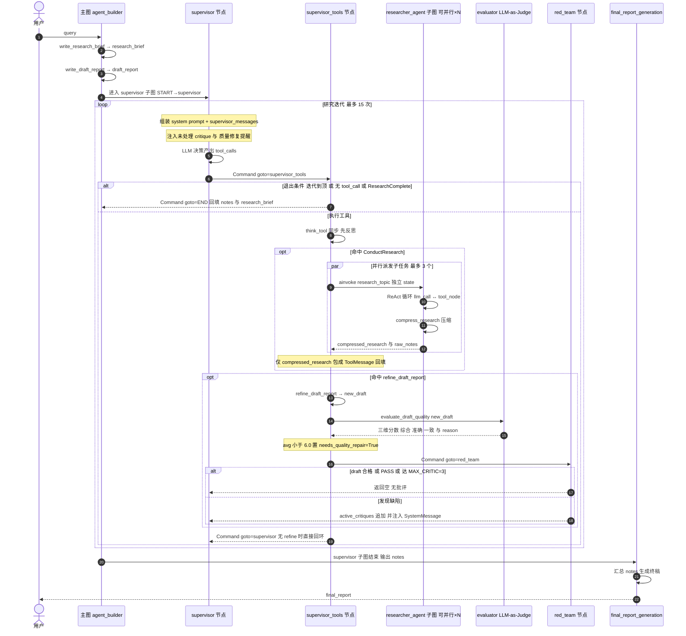
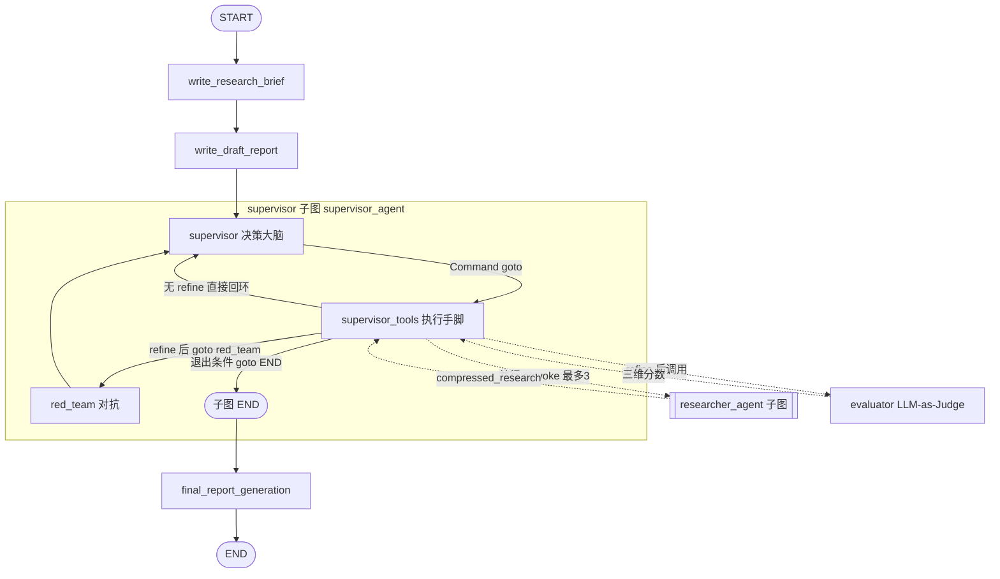
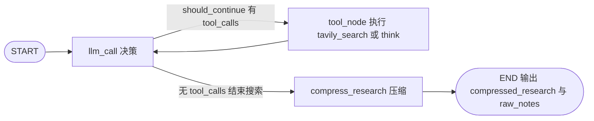

# Supervisor 完整执行流程图

> 覆盖：主图流水线 → supervisor 子图（supervisor / supervisor_tools / red_team）→ 并行 research 子 agent → evaluator 评估 → 终稿生成。
> 关键常量：`max_researcher_iterations=15`、`max_concurrent_researchers=3`、`min_need_repair_score=6.0`、`MAX_CRITIC=3`。

---

## 图 1：总时序图（含子 agent 并行）

从用户 query 到终稿的完整时间线，重点展示 supervisor 与 supervisor_tools 的迭代环、子 agent 的并行派发，以及"修稿 → 评估 → 红队对抗 → 回到 supervisor"的自我进化闭环。

---

## 图 2：状态流转图（LangGraph 图结构）

实线 = 图内真实边 / `Command(goto=...)` 跳转；虚线 = 在 `supervisor_tools` 节点函数里**命令式调用**的外部子图/模型（它们不是 supervisor 子图的节点）。

要点：`researcher_agent` 和 `evaluator` **不是** supervisor 子图里的节点，而是在 `supervisor_tools` 函数体内被 `ainvoke` / 调用的。真正在子图里循环的只有 `supervisor ↔ supervisor_tools ↔ red_team` 三个节点。

---

## 图 3：research 子 agent 内部 ReAct 循环

每个被并行派出去的子 agent 自己也是一张子图，持有独立的 `researcher_messages` 通道，跑标准 ReAct，最后压缩再返回。

要点：`tavily_search` 内部还会对**单个网页先摘要 + 截断 250K**（第一级压缩），`compress_research` 再对整轮结果压一次（第二级压缩）；`compressed_research` 回给 supervisor 决策，`raw_notes` 走旁路保存供终稿兜底。

---

## 三张图怎么连起来读

图 2 是"骨架"（有哪些节点、怎么跳），图 1 是"血肉"（一次迭代里到底按什么顺序发生了什么、谁调谁），图 3 是图 1 里 `researcher_agent` 那一个参与者的内部展开。面试时先用图 2 讲清架构分层，再用图 1 讲清迭代闭环与并行，最后用图 3 收口到"上下文隔离 + 两级压缩"。
